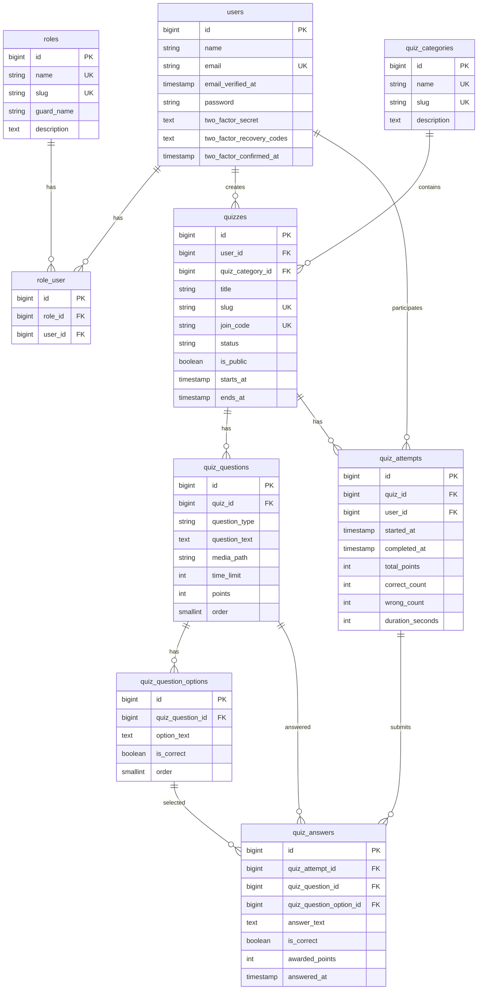

# Database Documentation

This document provides a comprehensive overview of the database schema for the Quiz Application.

## Table of Contents

- [Authentication & User Management](#authentication--user-management)
- [Role-Based Access Control](#role-based-access-control)
- [Quiz System](#quiz-system)
- [Database Relationships](#database-relationships)
- [ER Diagram](#er-diagram)

---

## Authentication & User Management

### `users`
Stores user account information.

| Column | Type | Constraints | Description |
|--------|------|-------------|-------------|
| `id` | BIGINT UNSIGNED | PRIMARY KEY, AUTO_INCREMENT | Unique user identifier |
| `name` | VARCHAR(255) | NOT NULL | Full name of the user |
| `email` | VARCHAR(255) | UNIQUE, NOT NULL | Email address (used for login) |
| `email_verified_at` | TIMESTAMP | NULLABLE | When email was verified |
| `password` | VARCHAR(255) | NOT NULL | Hashed password |
| `two_factor_secret` | TEXT | NULLABLE | Encrypted 2FA secret key |
| `two_factor_recovery_codes` | TEXT | NULLABLE | Encrypted recovery codes |
| `two_factor_confirmed_at` | TIMESTAMP | NULLABLE | When 2FA was confirmed |
| `remember_token` | VARCHAR(100) | NULLABLE | Token for "remember me" functionality |
| `created_at` | TIMESTAMP | NULLABLE | Record creation timestamp |
| `updated_at` | TIMESTAMP | NULLABLE | Record update timestamp |

**Indexes:**
- Unique index on `email`

**Relationships:**
- Has many `roles` through `role_user` (many-to-many)
- Has many `quizzes` (one-to-many, as creator)
- Has many `quiz_attempts` (one-to-many, as participant)

---

### `password_reset_tokens`
Stores password reset tokens for account recovery.

| Column | Type | Constraints | Description |
|--------|------|-------------|-------------|
| `email` | VARCHAR(255) | PRIMARY KEY | Email address requesting reset |
| `token` | VARCHAR(255) | NOT NULL | Reset token |
| `created_at` | TIMESTAMP | NULLABLE | Token creation time |

---

### `sessions`
Stores user session data.

| Column | Type | Constraints | Description |
|--------|------|-------------|-------------|
| `id` | VARCHAR(255) | PRIMARY KEY | Session identifier |
| `user_id` | BIGINT UNSIGNED | FOREIGN KEY, NULLABLE, INDEXED | User associated with session |
| `ip_address` | VARCHAR(45) | NULLABLE | IP address of session |
| `user_agent` | TEXT | NULLABLE | Browser/device information |
| `payload` | LONGTEXT | NOT NULL | Serialized session data |
| `last_activity` | INTEGER | INDEXED | Unix timestamp of last activity |

**Indexes:**
- Index on `user_id`
- Index on `last_activity`

---

## Role-Based Access Control

### `roles`
Defines user roles and permissions.

| Column | Type | Constraints | Description |
|--------|------|-------------|-------------|
| `id` | BIGINT UNSIGNED | PRIMARY KEY, AUTO_INCREMENT | Unique role identifier |
| `name` | VARCHAR(255) | UNIQUE, NOT NULL | Display name (e.g., "Admin", "Guru", "Siswa") |
| `slug` | VARCHAR(255) | UNIQUE, NOT NULL | URL-safe identifier (e.g., "admin", "teacher", "student") |
| `guard_name` | VARCHAR(255) | NOT NULL, DEFAULT 'web' | Authentication guard |
| `description` | TEXT | NULLABLE | Role description |
| `created_at` | TIMESTAMP | NULLABLE | Record creation timestamp |
| `updated_at` | TIMESTAMP | NULLABLE | Record update timestamp |

**Indexes:**
- Unique index on `name`
- Unique index on `slug`

**Relationships:**
- Has many `users` through `role_user` (many-to-many)

**Business Rules:**
- "Super Admin" role cannot be deleted
- Roles cannot be deleted if they have associated users

---

### `role_user`
Pivot table linking users to their roles (many-to-many).

| Column | Type | Constraints | Description |
|--------|------|-------------|-------------|
| `id` | BIGINT UNSIGNED | PRIMARY KEY, AUTO_INCREMENT | Unique identifier |
| `role_id` | BIGINT UNSIGNED | FOREIGN KEY, NOT NULL | Reference to `roles.id` |
| `user_id` | BIGINT UNSIGNED | FOREIGN KEY, NOT NULL | Reference to `users.id` |
| `created_at` | TIMESTAMP | NULLABLE | Record creation timestamp |
| `updated_at` | TIMESTAMP | NULLABLE | Record update timestamp |

**Indexes:**
- Unique composite index on `(role_id, user_id)`

**Constraints:**
- `CASCADE ON DELETE` for both `role_id` and `user_id`

---

## Quiz System

### `quiz_categories`
Organizes quizzes into categories.

| Column | Type | Constraints | Description |
|--------|------|-------------|-------------|
| `id` | BIGINT UNSIGNED | PRIMARY KEY, AUTO_INCREMENT | Unique category identifier |
| `name` | VARCHAR(255) | UNIQUE, NOT NULL | Category name |
| `slug` | VARCHAR(255) | UNIQUE, NOT NULL | URL-safe identifier |
| `description` | TEXT | NULLABLE | Category description |
| `created_at` | TIMESTAMP | NULLABLE | Record creation timestamp |
| `updated_at` | TIMESTAMP | NULLABLE | Record update timestamp |

**Indexes:**
- Unique index on `name`
- Unique index on `slug`

**Relationships:**
- Has many `quizzes` (one-to-many)

---

### `quizzes`
Represents a quiz/assessment created by a user.

| Column | Type | Constraints | Description |
|--------|------|-------------|-------------|
| `id` | BIGINT UNSIGNED | PRIMARY KEY, AUTO_INCREMENT | Unique quiz identifier |
| `user_id` | BIGINT UNSIGNED | FOREIGN KEY, NOT NULL | Creator (reference to `users.id`) |
| `quiz_category_id` | BIGINT UNSIGNED | FOREIGN KEY, NULLABLE | Category (reference to `quiz_categories.id`) |
| `title` | VARCHAR(255) | NOT NULL | Quiz title |
| `slug` | VARCHAR(255) | UNIQUE, NOT NULL | URL-safe identifier |
| `join_code` | VARCHAR(12) | UNIQUE, NOT NULL | 6-digit code for participants to join (like Kahoot PIN) |
| `description` | TEXT | NULLABLE | Quiz description |
| `status` | VARCHAR(255) | NOT NULL, DEFAULT 'draft' | Status: `draft`, `live`, `finished`, `archived` |
| `is_public` | BOOLEAN | NOT NULL, DEFAULT false | Whether quiz is publicly accessible |
| `time_per_question` | INTEGER | NULLABLE | Time limit override (seconds per question) |
| `starts_at` | TIMESTAMP | NULLABLE | Scheduled start time |
| `ends_at` | TIMESTAMP | NULLABLE | Scheduled end time |
| `settings` | JSON | NULLABLE | Additional settings (random order, show ranking, etc.) |
| `created_at` | TIMESTAMP | NULLABLE | Record creation timestamp |
| `updated_at` | TIMESTAMP | NULLABLE | Record update timestamp |

**Indexes:**
- Unique index on `slug`
- Unique index on `join_code`
- Index on `status`

**Constraints:**
- `CASCADE ON DELETE` for `user_id`
- `SET NULL ON DELETE` for `quiz_category_id`

**Relationships:**
- Belongs to `users` (creator)
- Belongs to `quiz_categories`
- Has many `quiz_questions` (one-to-many)
- Has many `quiz_attempts` (one-to-many)

---

### `quiz_questions`
Contains questions for each quiz.

| Column | Type | Constraints | Description |
|--------|------|-------------|-------------|
| `id` | BIGINT UNSIGNED | PRIMARY KEY, AUTO_INCREMENT | Unique question identifier |
| `quiz_id` | BIGINT UNSIGNED | FOREIGN KEY, NOT NULL | Reference to parent quiz |
| `question_type` | VARCHAR(255) | NOT NULL, DEFAULT 'multiple_choice' | Type: `multiple_choice`, `true_false`, `short_answer` |
| `question_text` | TEXT | NOT NULL | The question content |
| `media_path` | VARCHAR(255) | NULLABLE | Path to media file (image/audio/video) |
| `time_limit` | INTEGER | NOT NULL, DEFAULT 30 | Time limit in seconds |
| `points` | INTEGER | NOT NULL, DEFAULT 100 | Points awarded for correct answer |
| `order` | SMALLINT | NOT NULL, DEFAULT 0 | Display order within quiz |
| `created_at` | TIMESTAMP | NULLABLE | Record creation timestamp |
| `updated_at` | TIMESTAMP | NULLABLE | Record update timestamp |

**Indexes:**
- Composite index on `(quiz_id, order)`

**Constraints:**
- `CASCADE ON DELETE` for `quiz_id`

**Relationships:**
- Belongs to `quizzes`
- Has many `quiz_question_options` (one-to-many)
- Has many `quiz_answers` (one-to-many)

---

### `quiz_question_options`
Answer options for multiple-choice questions.

| Column | Type | Constraints | Description |
|--------|------|-------------|-------------|
| `id` | BIGINT UNSIGNED | PRIMARY KEY, AUTO_INCREMENT | Unique option identifier |
| `quiz_question_id` | BIGINT UNSIGNED | FOREIGN KEY, NOT NULL | Reference to parent question |
| `option_text` | TEXT | NOT NULL | Option content |
| `is_correct` | BOOLEAN | NOT NULL, DEFAULT false | Whether this is the correct answer |
| `order` | SMALLINT | NOT NULL, DEFAULT 0 | Display order within options |
| `created_at` | TIMESTAMP | NULLABLE | Record creation timestamp |
| `updated_at` | TIMESTAMP | NULLABLE | Record update timestamp |

**Indexes:**
- Unique composite index on `(quiz_question_id, order)`

**Constraints:**
- `CASCADE ON DELETE` for `quiz_question_id`

**Relationships:**
- Belongs to `quiz_questions`
- Referenced by `quiz_answers`

---

### `quiz_attempts`
Tracks each user's attempt at completing a quiz.

| Column | Type | Constraints | Description |
|--------|------|-------------|-------------|
| `id` | BIGINT UNSIGNED | PRIMARY KEY, AUTO_INCREMENT | Unique attempt identifier |
| `quiz_id` | BIGINT UNSIGNED | FOREIGN KEY, NOT NULL | Reference to the quiz |
| `user_id` | BIGINT UNSIGNED | FOREIGN KEY, NOT NULL | Participant user |
| `started_at` | TIMESTAMP | NULLABLE | When attempt started |
| `completed_at` | TIMESTAMP | NULLABLE | When attempt was completed |
| `total_points` | INTEGER | NOT NULL, DEFAULT 0 | Total points earned |
| `correct_count` | INTEGER | NOT NULL, DEFAULT 0 | Number of correct answers |
| `wrong_count` | INTEGER | NOT NULL, DEFAULT 0 | Number of incorrect answers |
| `duration_seconds` | INTEGER | NULLABLE | Time taken to complete (seconds) |
| `created_at` | TIMESTAMP | NULLABLE | Record creation timestamp |
| `updated_at` | TIMESTAMP | NULLABLE | Record update timestamp |

**Indexes:**
- Composite index on `(quiz_id, user_id)`

**Constraints:**
- `CASCADE ON DELETE` for both `quiz_id` and `user_id`

**Relationships:**
- Belongs to `quizzes`
- Belongs to `users` (participant)
- Has many `quiz_answers` (one-to-many)

---

### `quiz_answers`
Individual answers submitted by users during quiz attempts.

| Column | Type | Constraints | Description |
|--------|------|-------------|-------------|
| `id` | BIGINT UNSIGNED | PRIMARY KEY, AUTO_INCREMENT | Unique answer identifier |
| `quiz_attempt_id` | BIGINT UNSIGNED | FOREIGN KEY, NOT NULL | Reference to the attempt |
| `quiz_question_id` | BIGINT UNSIGNED | FOREIGN KEY, NOT NULL | Reference to the question |
| `quiz_question_option_id` | BIGINT UNSIGNED | FOREIGN KEY, NULLABLE | Selected option (for multiple choice) |
| `answer_text` | TEXT | NULLABLE | Text answer (for short answer/true-false) |
| `is_correct` | BOOLEAN | NOT NULL, DEFAULT false | Whether answer is correct |
| `awarded_points` | INTEGER | NOT NULL, DEFAULT 0 | Points awarded |
| `answered_at` | TIMESTAMP | NULLABLE | When answer was submitted |
| `created_at` | TIMESTAMP | NULLABLE | Record creation timestamp |
| `updated_at` | TIMESTAMP | NULLABLE | Record update timestamp |

**Indexes:**
- Unique composite index on `(quiz_attempt_id, quiz_question_id)`

**Constraints:**
- `CASCADE ON DELETE` for `quiz_attempt_id` and `quiz_question_id`
- `SET NULL ON DELETE` for `quiz_question_option_id`

**Relationships:**
- Belongs to `quiz_attempts`
- Belongs to `quiz_questions`
- Belongs to `quiz_question_options` (nullable)

---

## Database Relationships

### Entity Relationship Summary

```
users (1) ──────< (N) role_user (N) >──────── (1) roles
users (1) ──────< (N) quizzes
users (1) ──────< (N) quiz_attempts

quiz_categories (1) ──────< (N) quizzes
quizzes (1) ──────< (N) quiz_questions
quizzes (1) ──────< (N) quiz_attempts

quiz_questions (1) ──────< (N) quiz_question_options
quiz_questions (1) ──────< (N) quiz_answers

quiz_attempts (1) ──────< (N) quiz_answers
quiz_question_options (1) >──────── (N) quiz_answers
```

### Key Cascade Rules

**CASCADE ON DELETE:**
- Deleting a `user` will delete their:
  - Role assignments (`role_user`)
  - Created quizzes (`quizzes`)
  - Quiz attempts (`quiz_attempts`)
  - Session data (`sessions`)

- Deleting a `role` will delete:
  - Role assignments (`role_user`)

- Deleting a `quiz` will delete:
  - All questions (`quiz_questions`)
  - All attempts (`quiz_attempts`)

- Deleting a `quiz_question` will delete:
  - All options (`quiz_question_options`)
  - All answers (`quiz_answers`)

- Deleting a `quiz_attempt` will delete:
  - All answers (`quiz_answers`)

**SET NULL ON DELETE:**
- Deleting a `quiz_category` will set `quiz_category_id` to NULL in `quizzes`
- Deleting a `quiz_question_option` will set `quiz_question_option_id` to NULL in `quiz_answers`

---

## ER Diagram



---

## Additional Tables

### Cache System

The application includes Laravel's cache system tables (`cache`, `cache_locks`) for performance optimization.

### Job Queue System

The application includes Laravel's job queue tables (`jobs`, `job_batches`, `failed_jobs`) for background task processing.

---

## Migration Notes

- All tables use `bigint unsigned` for IDs
- All timestamp columns are nullable by default
- Foreign key constraints ensure referential integrity
- Unique constraints prevent data duplication
- Indexes optimize query performance for frequently accessed columns
